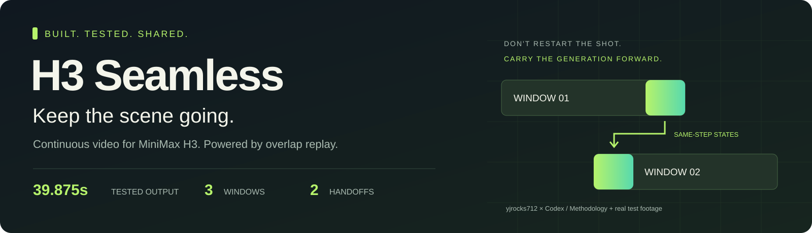
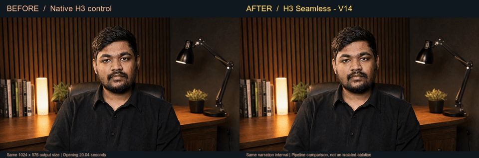
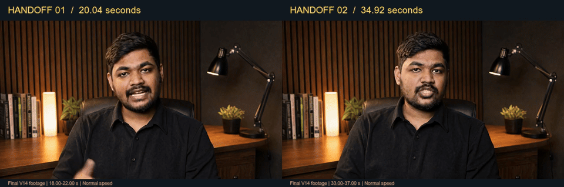

# H3 Seamless

**Your scene shouldn't restart when the generation window ends.**

We built an H3 continuation system that carries the generation forward: the same scene, the original narration, and a fixed-size active video window. It ran successfully across **39.875 seconds, three windows, and two handoffs**. Here is the footage.

**[Watch the full result](assets/h3-seamless-v14.mp4)** · **[Watch before / after](assets/before-after.mp4)** · **[Read the method](docs/METHOD.md)**

## Watch the jump disappear

**Left:** the native control abruptly reframes at about **1.33 seconds**. **Right:** the final H3 Seamless pipeline holds the shot through the same interval. Same reference scene, narration interval, output resolution, and playback speed.

This is a whole-pipeline comparison. The opening improvement is not evidence for replay alone: the first replay handoff happens later. We also include the [matched native/V7 attention study](docs/MEDIA.md#the-matched-attention-study), which separates that earlier component test from the final V14 result.

## Then keep going

Two different moments from the **same final video**: 18–22 seconds on the left, 33–37 seconds on the right. The handoffs occur at approximately **20.04 s** and **34.92 s**. No obvious scene reset or identity jump was found in the reviewed transition frames.

| Real output | How it ran |
| --- | --- |
| **957 frames · 1024 × 576 · 24 FPS** | Three generation windows, two handoffs |
| **About 20 seconds of active video state** | Completed windows are released |
| **Eight native PDD steps per window** | Original pretrained weights; no new training |
| **Original narration retained** | Exact PCM in the historical lossless master; AAC in these viewing copies |

These are real experiment outputs, not AI-generated promotional reconstructions. The GIFs are compressed previews. [Media provenance, source clips, timestamps, and hashes](docs/MEDIA.md) are included.

## What we fixed

We were trying to make one continuous presenter video. Earlier experiments exposed reframing, flashes, and consistency problems. Keeping the entire timeline active also created a memory-scaling problem.

**We built the implementation, fixed the numerical blocker, and got the short test working.** The solution combines three pieces:

1. **Keep attention focused.** Nearby video and aligned audio share the original image/prompt context. This is our FreeLOC-inspired H3 attention adaptation.
2. **Remember the generation, not just the finished picture.** Save the overlap's internal states throughout denoising. At every step of the next window, replay the corresponding saved state while generating new footage alongside it.
3. **Move forward without keeping everything.** Commit new latents once, stream the native decoder, preserve absolute audio/video timing, and release completed video state.

We also corrected a shape-dependent TF32 audio-encoding mismatch by scoping IEEE FP32 arithmetic to audio encoding. The original tolerance then passed in the complete render.

The technical name for the extra handoff mechanism is **step-matched overlap-trajectory replay**. It acts during generation, not as a cosmetic crossfade on the finished video.

## More than the existing continuation path

The [inspected Wan2GP H3 continuation](https://github.com/deepbeepmeep/Wan2GP/blob/7e6242e4b6e3e60eaf4a888115141979f3e5c471/models/minimax_h3/pipeline.py#L692) uses encoded finished history frames and a final-frame image condition. Our handoff preserves the actual sampled overlap states at matching denoising steps, without decoding and re-encoding the overlap between windows.

We proposed, coded, and tested this H3-specific integration. It is additional to the attention ideas taken from FreeLOC—not merely a selection of FreeLOC features.

## Built here. Credited properly.

**Built by [yjrocks712](https://github.com/yjrocks712) with Codex.** The project owner directed the work and evaluated outputs; Codex proposed, wrote, and integrated the experimental implementation.

- **MiniMax H3 and Wan2GP:** the pretrained model, runtime, native sampler, encoders, and decoders we built on.
- **[FreeLOC](https://github.com/Westlake-AGI-Lab/FreeLOC):** direct inspiration for the attention design.
- **[FrameCache](https://arxiv.org/html/2601.22160v2#S3.SS3) and [VidRD / Reuse and Diffuse](https://github.com/anonymous0x233/ReuseAndDiffuse):** related published continuation methods identified in the later prior-art review.

> Prior work was present in FrameCache, which is a research framework described in a paper, and VidRD, which is a research framework with both a paper and a public code repository.

We own the engineering work without claiming a world-first algorithm. The [attribution and development chronology](docs/PRIOR_WORK.md) explains exactly what the records establish about inspiration, proposal timing, and implementation.

## Open the hood

| Start here | What you get |
| --- | --- |
| [Method](docs/METHOD.md) | Window geometry, replay pseudocode, attention, clocks, decoder, and audio precision |
| [Media evidence](docs/MEDIA.md) | Source videos, adjacent-frame proof, exact comparisons, and reproducible media tooling |
| [Results](docs/RESULTS.md) | Measurements, review scope, failures, and unresolved issues |
| [Reproduction guide](docs/REPRODUCTION.md) | Integration contracts, correctness checks, and controlled test plans |
| [Credits and prior work](docs/PRIOR_WORK.md) | Who contributed what, and how this relates to existing research |

**Release contents:** methodology, pseudocode, actual output videos, comparison assets, and the tool used to assemble those assets. The original renderer and deployment bundle are not packaged as an installable plugin in this release.

## What is still open

The successful test is about **40 seconds**, not five or ten minutes. Mouth behaviour around pauses needs further work. The full-stack run did not isolate the benefit of every component, and its roughly **126 GiB peak PyTorch allocation** is not a consumer-GPU demonstration. A bounded video window is not a claim of zero drift or unlimited-duration quality.

The next step is clear: reproduce the short result, isolate the components, then test longer and more varied footage. The [evaluation guide](docs/REPRODUCTION.md) lays out how.
