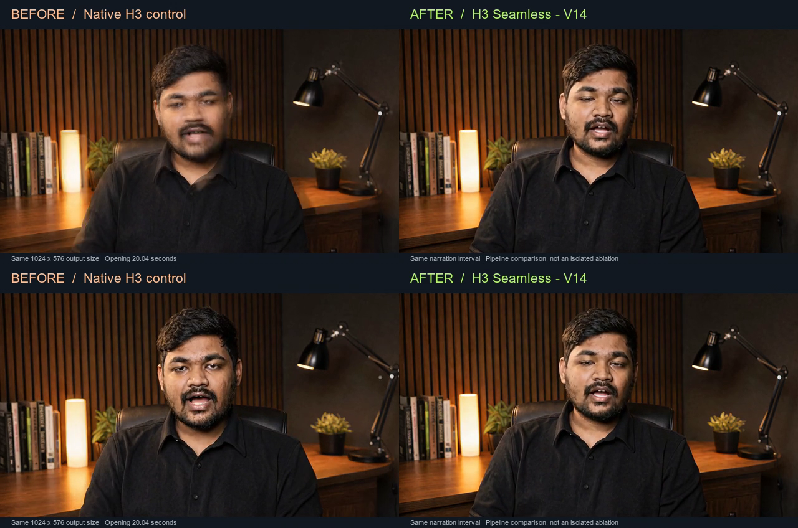

# See the result, inspect the comparison

These assets come from existing project renders, recovered from the archive and inspected again for this publication. No new model inference was performed to make the demonstrations.

## Original-resolution viewing copies

| Video | Duration / frames | What it is |
| --- | --- | --- |
| [H3 Seamless / V14](../assets/h3-seamless-v14.mp4) | 39.875 s / 957 | The final bounded-window trajectory-replay run |
| [Native H3 control](../assets/native-control.mp4) | 20.0417 s / 481 | The native-global arm of the earlier matched attention study |
| [Shared-attention V7](../assets/attention-v7.mp4) | 20.0417 s / 481 | The modified-attention arm of that same study |

All three are 1024 × 576 at 24 FPS. These files preserve the audio/video streams from the archived MP4s; their containers were rewritten to strip metadata and support fast-start playback. SHA-256 stream hashes of the compressed video and audio packets match the archived originals for all three copies. They are compressed H.264/AAC viewing copies, not the lossless PCM masters.

## Main before-and-after comparison

[Watch the entire 20-second side-by-side](../assets/before-after.mp4).

The left panel is the native control. The right panel is the final V14 output over the same opening time interval. The GIF on the README shows seconds 0–4 at normal speed, sampled to 12 FPS for size. The MP4 is 24 FPS. The side-by-side carries V14's audio once, rather than mixing both tracks.

The visible native reframing occurs between zero-based frames 31 and 32, at about 1.29–1.33 seconds. Here are those consecutive frames, top then bottom:



**Comparison boundary:** V14 includes the attention intervention, audio-precision correction, and later-window trajectory replay. Its first replay handoff is at approximately 20.04 seconds, outside the opening GIF. The opening comparison must not be described as proof that replay alone eliminated the reframe. It shows the visible difference between the native baseline and the complete final pipeline at that timestamp.

No colour correction, sharpening, face repair, frame interpolation, motion smoothing, or generated replacement frames were applied. Compositing adds labels and changes display size; GIF conversion reduces frame rate and colour precision. Inspect the original-resolution viewing copies for details.

## The matched attention study

The native and V7 source clips came from the same 8 September 2026 higher-resolution pair. The contemporaneous report records the same original image, prompt, narration, seed 8055, BF16 resident weights, eight-step native PDD sampling, positions, resolution, actual initial video/audio states, and actual prompt/image encodings within that pair. The recorded engine revision was `057f9ecab9ad57dfbec9768b2daf7a4426ce986c`.

The intervention was internal shared/local attention. The native clip reframes between frames 31 and 32; the V7 clip does not show that reset at the same frames. This is evidence for the earlier attention intervention, which was carried into V14. V7 was still a full-timeline 20-second generation and did not implement V14's bounded-window state replay.

The later V14 run intentionally changed audio precision. Do not present native-versus-V14 as the same single-component matched ablation as native-versus-V7.

## The two actual V14 handoffs

[Watch the handoff excerpts](../assets/handoffs.mp4).

The left panel shows 18–22 seconds of V14; the right shows 33–37 seconds. Both play at normal speed. They are separate intervals shown side by side, not simultaneous camera views. The first fully new frames arrive at 481 and 838 (20.0417 and 34.9167 seconds), with the native decoder's short blend preceding them.

The clip is muted to avoid combining unrelated narration times. Use the full V14 video for the continuous soundtrack. The GIF loops back to each excerpt's start after four seconds; that loop reset is not a generation handoff.

## Integrity and reproducible presentation

[The media manifest](../assets/media-manifest.json) records SHA-256 checksums, stream metadata, source identities, and excerpt intervals. It contains no private source filesystem paths. The archived V14 source MP4's checksum can be compared with the historical report:

```text
9ccc39a8f50d901e947623e2483232a528fd55b8ff0be23b6bef6c2ae8739963
```

[The build tool](../tools/build_demo.py) uses FFmpeg and ImageMagick to create the labelled presentation assets from supplied video paths. ImageMagick renders vector labels only; it does not retouch the footage. The three source media inputs must meet the documented frame-count and resolution checks.

```bash
python3 tools/build_demo.py \
  --before /path/to/native-control.mp4 \
  --attention /path/to/attention-v7.mp4 \
  --after /path/to/h3-seamless-v14.mp4 \
  --out /path/to/new-output-directory
```

The builder refuses FFmpeg overwrites by default; `--replace` explicitly permits replacement of its generated media. Supply `--font` if neither the macOS Arial nor Linux DejaVu font location exists. Rerunning against the published stream-preserving copies will retain visual content, but their source container hashes differ from the archived originals because metadata was stripped.

This script reproduces the presentation, not the H3 model inference. See the [reproduction guide](REPRODUCTION.md) for the remaining renderer-release requirements.

### GitHub link-preview image

The [social preview](../assets/social-preview.png) uses frame 32 of the published native/V14 comparison, scaled uniformly and placed within a 1280 × 640 branded card. It is a still from the whole-pipeline comparison, not a separate experiment. No synthetic replacement imagery is used.

Rebuild it with Node.js, FFmpeg, and Sharp installed:

```bash
node tools/build_social_preview.cjs
# Add --replace only to replace the existing generated preview.
```

The [builder](../tools/build_social_preview.cjs) verifies the card stays under 1 MB for GitHub. This additional branding asset is separate from the eight experimental presentation assets recorded in `media-manifest.json`.
